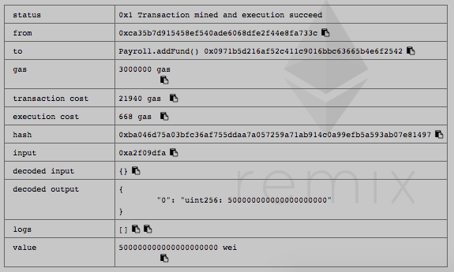
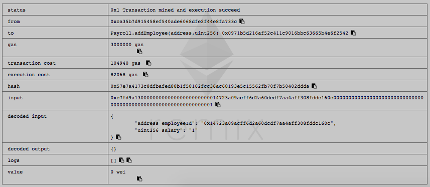
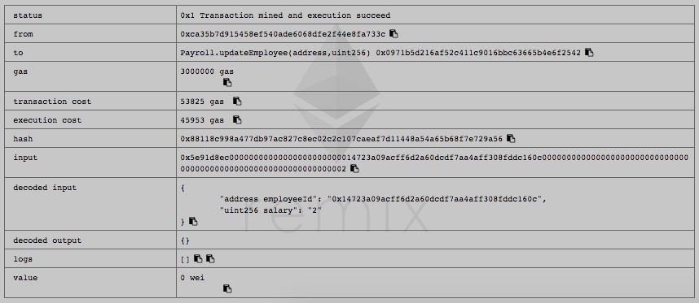
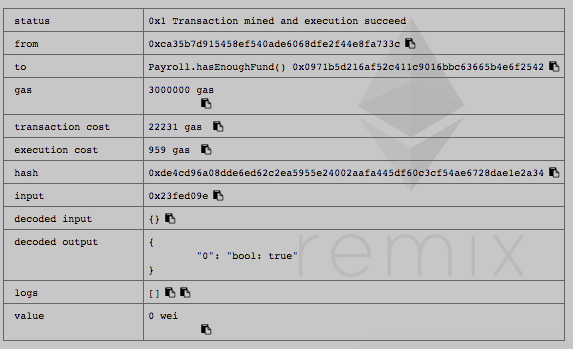
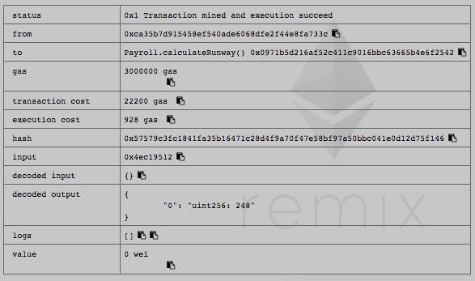
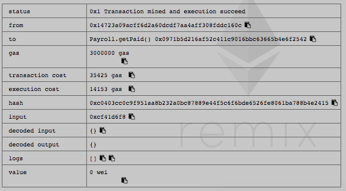
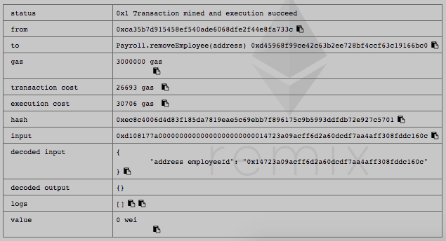

## 硅谷live以太坊智能合约 第三课作业
这里是同学提交作业的目录

### 第三课：课后作业
- 第一题：完成今天所开发的合约产品化内容，使用Remix调用每一个函数，提交函数调用截图
- 第二题：增加 changePaymentAddress 函数，更改员工的薪水支付地址，思考一下能否使用modifier整合某个功能
- 第三题（加分题）：自学C3 Linearization, 求以下 contract Z 的继承线
- contract O
- contract A is O
- contract B is O
- contract C is O
- contract K1 is A, B
- contract K2 is A, C
- contract Z is K1, K2

---

#### 函数调用如下

1 addFund



2 addEmployee



3 updateEmployee



4 hasEnoughFund



5 calculateRunway



6 getPaid



7 removeEmployee



#### 添加changePaymentAddress函数，更改员工的薪水支付地址

```javascript
function changePaymentAddress(address employeeId, address NewAddress) onlyOwner _employeeExist(employeeId) {
        var employee = employees[employeeId];
        _partialPaid(employee);
        employee.id = NewAddress;
    }
```

#### contract Z 的继承线

```
L(O)  := [O]

L(A)  := [A] + merge(L(O), [O])
       = [A] + merge([O], [O])
       = [A, O]

L(B)  := [B, O]
L(C)  := [C, O]

L(K1) := [K1] + merge(L(A), L(B), [A, B])
       = [K1] + merge([A, O], [B, O], [A, B])
       = [K1, A] + merge([O], [B, O], [B])
       = [K1, A, B] + merge([O], [O])
       = [K1, A, B, O]

L(K2) := [K2, A, C, O]

L(Z)  := [Z] + merge(L(K1), L(K2), [K1, K2])
       = [Z] + merge([K1, A, B, O], [K2, A, C, O], [K1, K2])
       = [Z, K1] + merge([A, B, O], [K2, A, C, O], [K2])
       = [Z, K1, K2] + merge([A, B, O], [A, C, O])
       = [Z, K1, K2, A] + merge([B, O], [C, O])
       = [Z, K1, K2, A, B] + merge([O], [C, O])
       = [Z, K1, K2, A, B, C] + merge([O], [O])
       = [Z, K1, K2, A, B, C, O]
```


