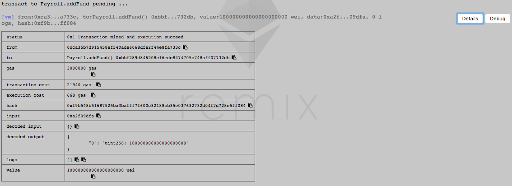

## 硅谷live以太坊智能合约 第三课作业
这里是同学提交作业的目录

### 第三课：课后作业
- 第一题：完成今天所开发的合约产品化内容，使用Remix调用每一个函数，提交函数调用截图
```
合约Owner: "0xca35b7d915458ef540ade6068dfe2f44e8fa733c"
1. msg.sender为"0xca35b7d915458ef540ade6068dfe2f44e8fa733c"（合约Owner）的函数调用结果
	过程如下：
	1.1 addFund(100 ether)
	1.2 添加第一个employee: addEmployee("0x14723a09acff6d2a60dcdf7aa4aff308fddc160c", 1)
	1.3 添加第二个employee: addEmployee("0x4b0897b0513fdc7c541b6d9d7e929c4e5364d2db", 2)
	1.4 删除第一个employee: removeEmployee("0x14723a09acff6d2a60dcdf7aa4aff308fddc160c")
	1.5 更新第二个employee: updateEmployee("0x4b0897b0513fdc7c541b6d9d7e929c4e5364d2db", 3)
	1.6 calculateRunway()
	1.7 hasEnoughFund()
	1.8 getPaid()
	结果如下：
	
2. msg.sender为"0x4b0897b0513fdc7c541b6d9d7e929c4e5364d2db"（第二个employee）的函数调用结果
	过程如下：
	2.1 addFund(100 ether)
	2.2 添加第三个employee: addEmployee("0x583031d1113ad414f02576bd6afabfb302140225")
	2.3 删除第二个employee: removeEmployee("0x4b0897b0513fdc7c541b6d9d7e929c4e5364d2db")
	2.4 更新第二个employee: updateEmployee("0x4b0897b0513fdc7c541b6d9d7e929c4e5364d2db", 5)
	2.5 calculateRunway()
	2.6 hasEnoughFund()
	2.7 getPaid()
	结果如下：
	
```
- 第二题：增加 changePaymentAddress 函数，更改员工的薪水支付地址，思考一下能否使用modifier整合某个功能
```
 function changePaymentAddress(address oldAddr, address newAddr) onlyOwner hasEmployee(oldAddr) {
        addEmployee(newAddr, employees[oldAddr].salary);
        removeEmployee(oldAddr);
    }
```

- 第三题（加分题）：自学C3 Linearization, 求以下 contract Z 的继承线
- contract O
```
L(O) := [O]
```
- contract A is O
```
L(A) := [A] + merge(L(O), [O])
= [A] + merge([O], [O])
= [A] + [O]
= [A, O]
```
- contract B is O
```
L(B) := [B] + merge(L(O), [O])
= [B] + merge([O], [O])
= [B] + [O]
= [B, O]
```
- contract C is O
```
L(C) := [C] + merge(L(O), [O])
= [C] + merge([O], [O])
= [C] + [O]
= [C, O]
```
- contract K1 is A, B
```
L[K1] := [K1] + merge(L[A], L[B], [A, B])
= [K1] + merge([A, O], [B, O], [A, B])
= [K1, A] + merge([O], [B, O], [B])
= [K1, A, B] + merge([O], [O])
= [K1, A, B, O]
```

- contract K2 is A, C
```
L[K2] := [K2] + merge(L[A], L[C], [A, C])
= [K2] + merge([A, O], [C, O], [A, C])
= [K2, A] + merge([O], [C, O], [C])
= [K2, A, C] + merge([O], [O])
= [K2, A, C, O]
```

- contract Z is K1, K2
```
L[Z] := [Z] + merge(L[K1], L[K2], [K1, K2])
= [Z] + merge([K1, A, B, O], [K2, A, C, O], [K1, K2])
= [Z, K1] + merge([A, B, O], [K2, A, C, O], [K2])
= [Z, K1, K2] + merge([A, B, O], [A, C, 0])
= [Z, K1, K2, A] + merge([B, O], [C, O])
= [Z, K1, K2, A, B] + merge([O], [C, O])
= [Z, K1, K2, A, B, C] + merge([O], [O])
= [Z, K1, K2, A, B, C, O]
```