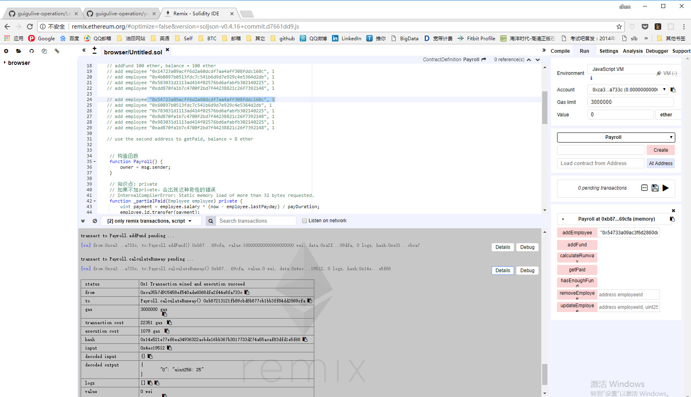
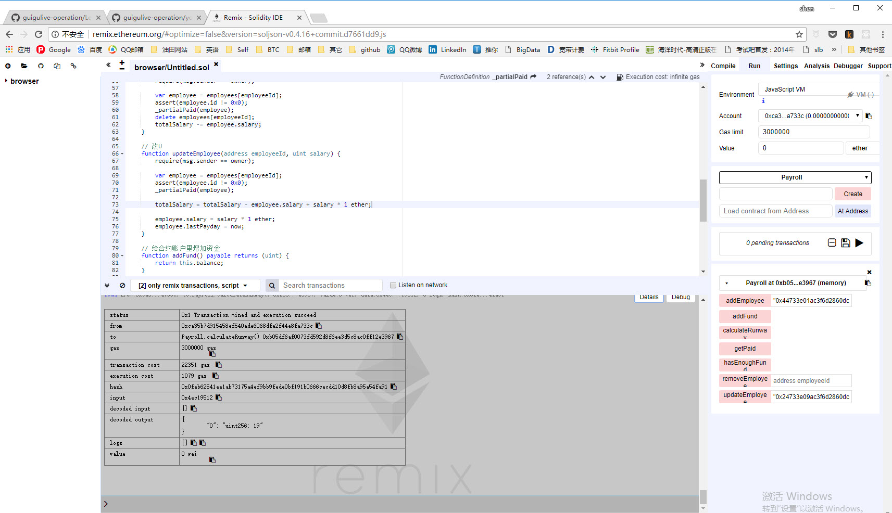
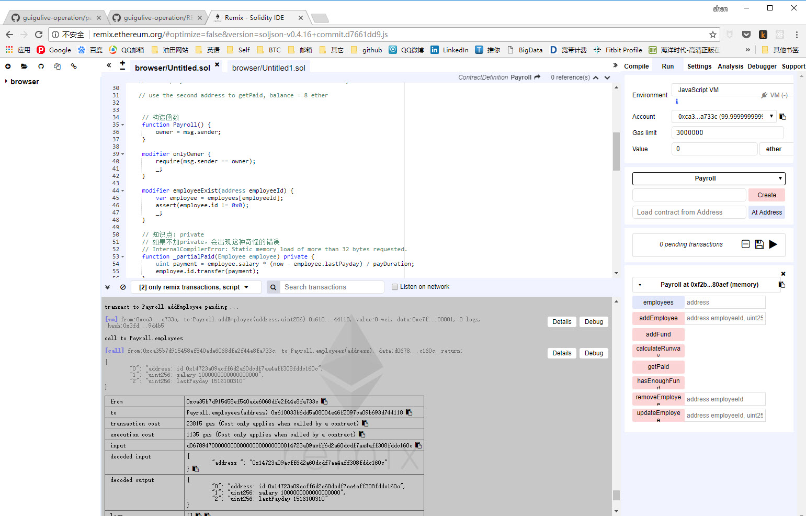
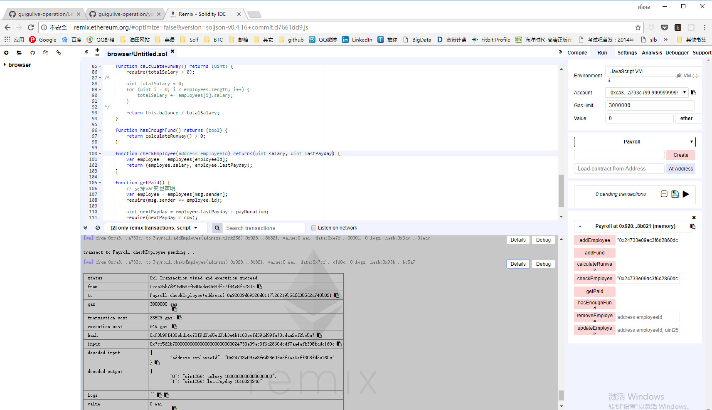
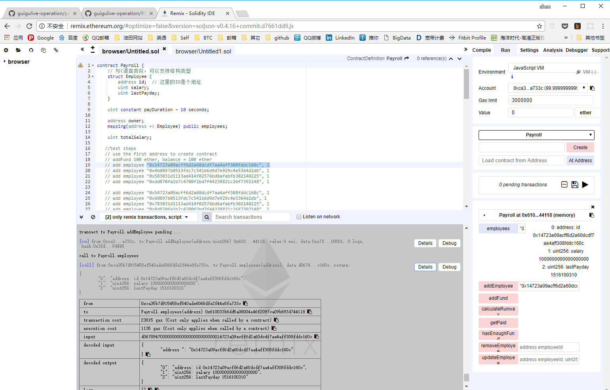
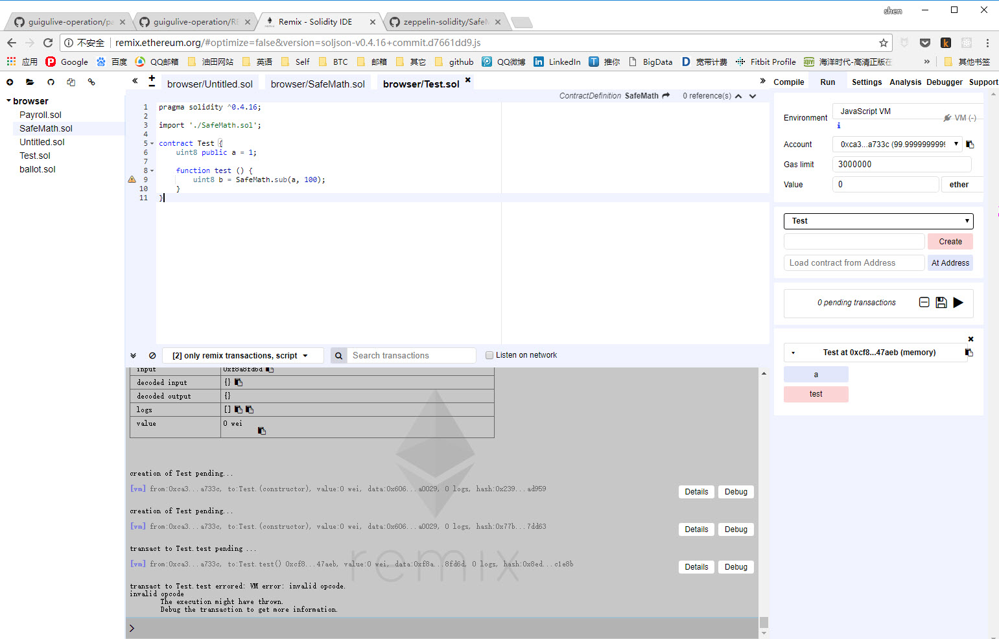

第三课的作业看这一个文档就够了

## 第一题
### 修改后的代码消耗的gas是一样的。



### public成员变量


### 修饰符


### 带命名的参数


### 用public修改后的Payroll程序，右侧会出现蓝色的变量名


### 试验Zeppelin中的SafeMath



## 第二题
只保留了改变的部分
```
    modifier onlyOwner {
        require(msg.sender == owner);
        _;
    }
    
    modifier employeeExist(address employeeId) {
        var employee = employees[employeeId];
        assert(employee.id != 0x0);
        _;
    }
    
    //只有合约的生成者可以修改员工的地址
    function changePaymentAddress(address employeeId, address newId) onlyOwner employeeExist(employeeId) {
        var employee = employees[employeeId];
        delete employees[employeeId];
        employee.id = newId;
        employees[newId] = employee; //还得更新mapping
    }
```

## 第三题

在讲Solidity的多重继承时遇到了C3 Linearization这个概念，查阅维基百科后，发现它是在面向对象的多重继承时遇到的问题，我不知道如何翻译，先翻译为C3线序化吧。

多重继承时会出现比较复杂的情况，在父类中出现相同的方法时，在子类中出现的调用语句需要知道明确地调用谁。因此有了这个线序化的算法，详性见 https://en.wikipedia.org/wiki/C3_linearization

主要的步骤在这样一段话中：

> The merge of parents' linearizations and parents list is done by selecting the first head of the lists which does not appear in the tail (all elements of a list except the first) of any of the lists. Note, that a good head may appear as the first element in multiple lists at the same time, but it is forbidden to appear anywhere else. The selected element is removed from all the lists where it appears as a head and appended to the output list. The process of selecting and removing a good head to extend the output list is repeated until all remaining lists are exhausted. If at some point no good head can be selected, because the heads of all remaining lists appear in any one tail of the lists, then the merge is impossible to compute due to cyclic dependencies in the inheritance hierarchy and no linearization of the original class exists.

假设父类是P，子类是C，它们的线序号分别记为L(P)，L(C)，则有：

子类C的线序号L(C)，第一个元素是其本身，然后是对L(P)和所有父类的merge运算，描述起来非常非常拗口，看例子和表达式就明白了。

merge操作也挺有意思，从每个数组中找head元素，并且这个head不能出现在其它数组的尾部tail。

关于tail的定义是这样的，head是一个元素，剩下的部分都是tail。例如：head([A,B,C,D]) = A，而tail([A,B,C,D]) = [B,C,D]

对于如下的合约（类）的继承关系：
```
contract O
contract A is O
contract B is O
contract C is O
contract K1 is A, B
contract K2 is A, C
contract Z is K1, K2
```
我用graphviz画出来它的类图。
```
digraph G{
   edge[dir="back"];
   O -> A
   O -> B
   O -> C
   A -> K1
   B -> K1
   A -> K2
   C -> K2
   K1 -> Z
   K2 -> Z
}
```
类图是这样的：

听助教讲，solidity中继承多个对象时的顺序与平常的语言是反的
contract K1 is A, B
这句的意思是B是最近的继承关系， 原来的作业都弄反了


计算各个类的线序的详细步骤：
```
L(O) := [O]  
L(A) := [A] + merge(L(O), [O]) // A本身 + merge(L(父亲) + 父亲列表)
      = [A] + merge([O], [O])
      = [A, O]  
L(B) := [B, O]
L(C) := [C, O]
L(K1):= [K1] + merge(L(B), L(A), [B, A])
      = [K1] + merge([B, O], [A, O], [B, A])
      = [K1, B] + merge([O], [A, O], [A])
      = [K1, B, A] + merge([O], [O])
      = [K1, B, A, O] 
L(K2):= [K2, C, A, O] 
L(Z) := [Z] + merge(L(K2), L(K1), [K2, K1])
      = [Z] + merge([K2, C, A, O], [K1, B, A, O], [K2, K1] )
      = [Z, K2] + merge([C, A, O], [K1, B, A, O], [K1] )
      = [Z, K2, C] + merge([A, O], [K1, B, A, O], [K1] )
      = [Z, K2, C, K1] + merge([A, O], [B, A, O] )
      = [Z, K2, C, K1, B] + merge([A, O], [A, O] )
      = [Z, K2, C, K1, B, A] + merge([O], [O] )
      = [Z, K2, C, K1, B, A, O]
```
有了这个线序化之后，当Z中有一个函数时，如果在父类中也存在，则沿着这个列表的顺序去找，先找到哪个就执行哪个类里的方法。
