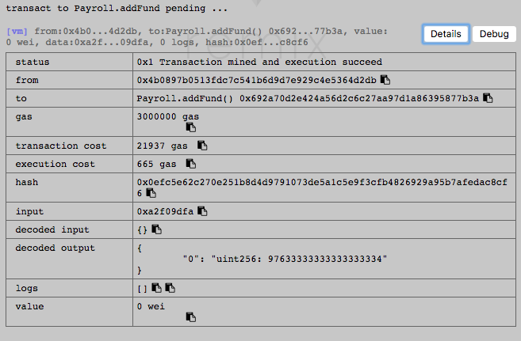
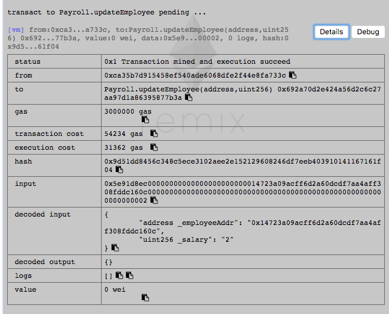
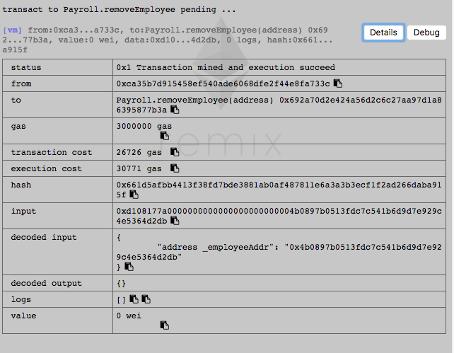
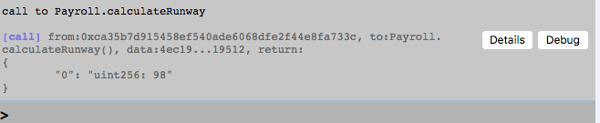
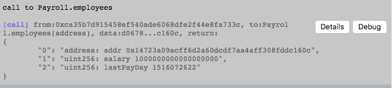

### 第一题、函数调用截图

##### 1）添加余额



##### 2）添加雇员




##### 3）更新雇员


##### 4）移除雇员



##### 5）工资可用次数



##### 6）获取工资


##### 7）所有者


##### 8）雇员信息获取



##### 9）转移所有者


## 第二题、更改员工薪水支付地址

```javascript
/**
 * 更新员工收取工资地址
 */
function changePaymentAddress(address _oldAddr, address _newAddr) 
								public onlyOwner employeeExist(_oldAddr) {

      var employee 					= employees[_oldAddr];
      employees[_newAddr].addr 		= _newAddr;
      employees[_newAddr].salary 		= employee.salary;
      employees[_newAddr].lastPayDay 	= employee.lastPayDay;
      delete employees[_oldAddr];
    }
```


## 第三题、学习C3 Linearization，求继承线

> 最终继承线为：[Z, K1, K2, A, B, C, O]

解答步骤：

```
L(O) := O

L(A) := [A] + merge(L(O), [O])
	  = [A] + merge([O], [O])
	  = [A, O]
		
L(B) := [B] + merge(L(O), [O])
      = [B] + merge([O], [O])
      = [B, O]
      
L(C) := [C] + merge(L(O), [O])
      = [C] + merge([O], [O])
      = [C, O]
      
L(K1) := [K1] + merge(L(B), L(A), [B, A])
	   = [K1] + merge([B, O], [A, 0], [B, A])
	   = [K1, B] + merge([O], [A, O], [A])
	   = [K1, B, A] + merge([O], [O])
	   = [K1, B, A, O]

L(K2) := [K2] + merge(L(C), L(A), [C, A])
	   = [K2] + merge([C, O], [A, 0], [C, A])
	   = [K2, C] + merge([O], [A, O], [A)
	   = [K2, C, A] + merge([O], [O])
	   = [K2, C, A, O]

L(Z) := [Z] + merge(L[K2], L[K1], [K2, K1])
      = [Z] + merge([K2, C, A, O], [K1, B, A, O], [K2, K1])
      = [Z, K2] + merge([C, A, O], [K1, B, A, O], [K1])
      = [Z, K2, C] + merge([A, O], [K1, B, A, O], [K1])
      = [Z, K2, C, K1] + merge([A, 0], [B, A, O])
      = [Z, K2, C, K1, B] + merge([A, O], [A, O])
      = [Z, K2, C, K1, B, A] + merge([O], [O])
      = [Z, K2, C, K1, B, A, O]
```

