# Contract执行流程

1. addFund

调用AddFund。

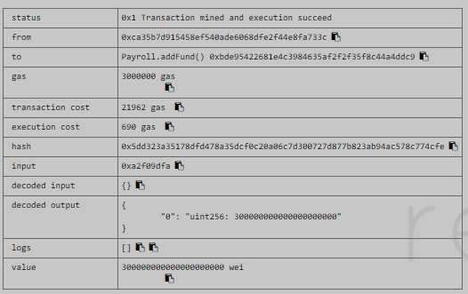

2. addEmployee

调用addEmployee。

调用后可以查询到。

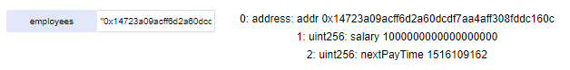

3. updateEmployee

调用之前余额为102 ether。

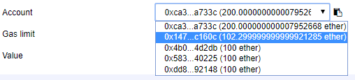

调用updateEmployee。

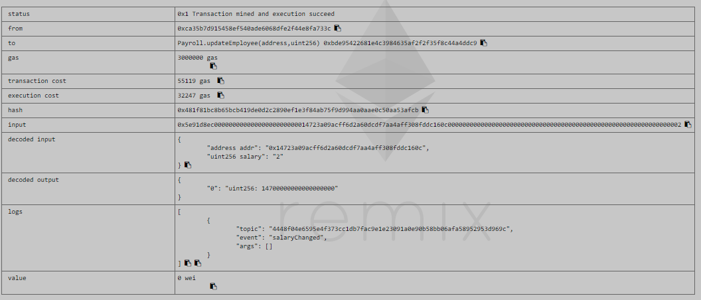

调用之后余额为117 ether。验证了未支付的费用在调用updateEmployee时会进行支付。

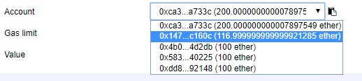

调用之后，可以查询到更新后的salary。

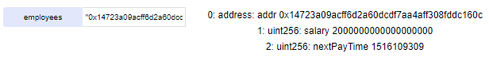

4. getPaid

调用之前余额为119 ether。

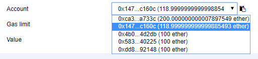

调用getPaid。

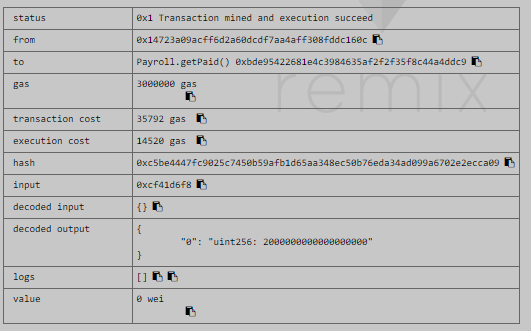

调用之后余额为121 ether。

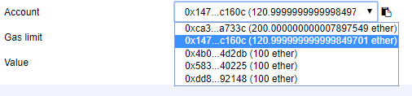

5. changePaymentAddress

调用changePaymentAddress。

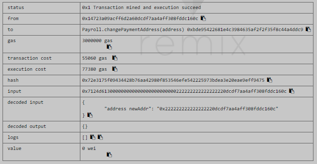

调用之后，旧地址不存在。

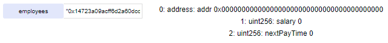

调用之后，可以查询到新地址。

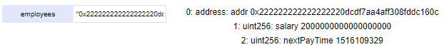

6. removeEmployee

调用removeEmployee。

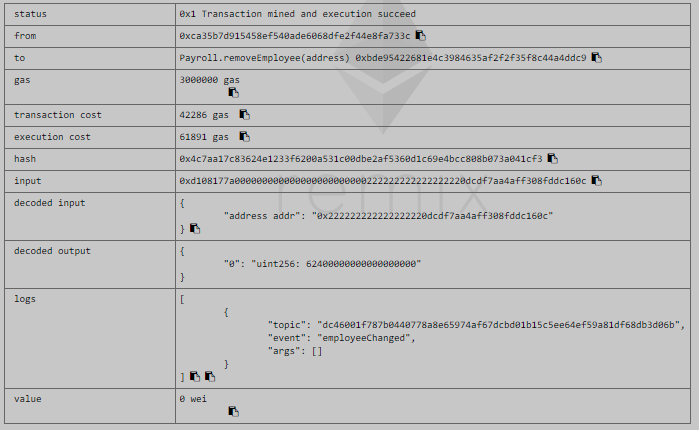

调用之后，employee不存在。

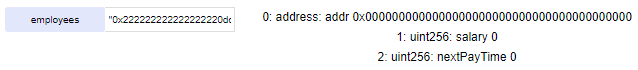

7. calculateRunway

调用calculateRunway。

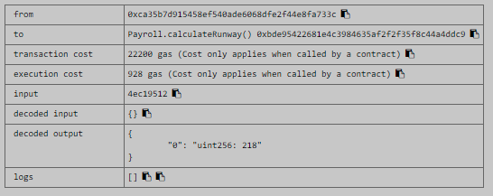

